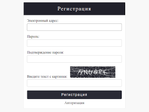
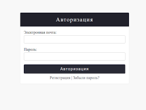
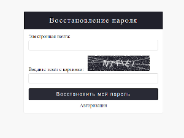
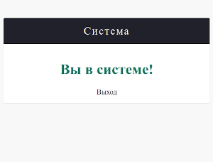

# Пример авторизции, регистрации выхода и смены пароля.

### Функционал:

1. Регистрация с использованием электронной почты, с активацией аккаунта по электронной почте.
2. Авторизация с использованием электронной почты, использование электронной почты как уникальное поле имени.
3. Сброс пароля с использованием электронной почты.
4. Выход из системы.

### Оснобенности:

1. Изменненный модель User, изменено отображение в административной панели.
2. Проверяет электронную почту до отправки формы на сервер. (jQuery Ajax). (Регистрация, Авторизация)
3. Использование Celery с Redis при отправке электронного письма.
   (Регистрация, Сброс пароля).
4. Использование Captcha.(Регистрация, Сброс пароля).

### Внешний вид:

\

### Начало работы:
#### 1. Файл django_settings/settings.py: 
Добавить: Настройки Электронной почты:\
   1.1. TODO: Адрес электронной почты.\
   1.2. TODO: Пароль электронной почты.

#### 2. Установить зависимости:
>pip install -r requirements.txt

#### 3. Запустить Redis:
> docker-compose up
#### 4. Запустить Celery:
> celery -A django_settings worker --loglevel INFO
#### 5. Применить миграции и создать пользователя:
> python manage.py makemigrations \
> python manage.py migrate \
> python manage.py createsuperuser
### 6. Запустить Django.
> python manage.py runserver

